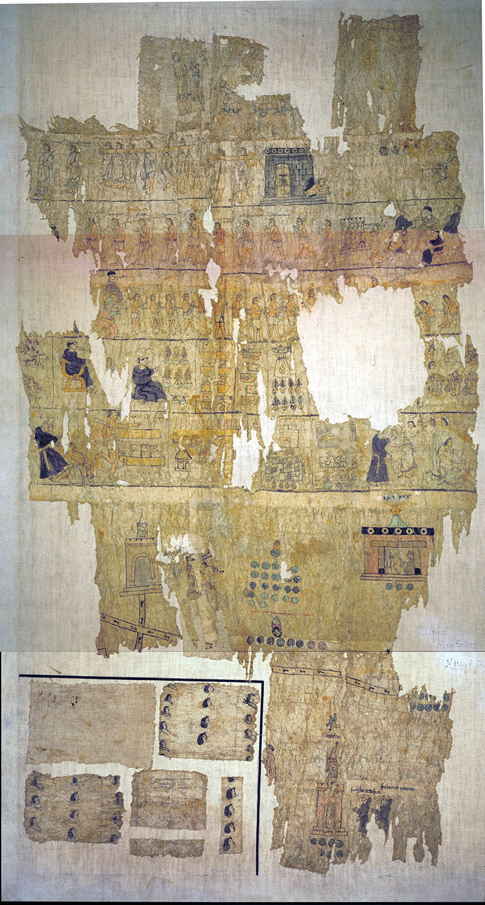
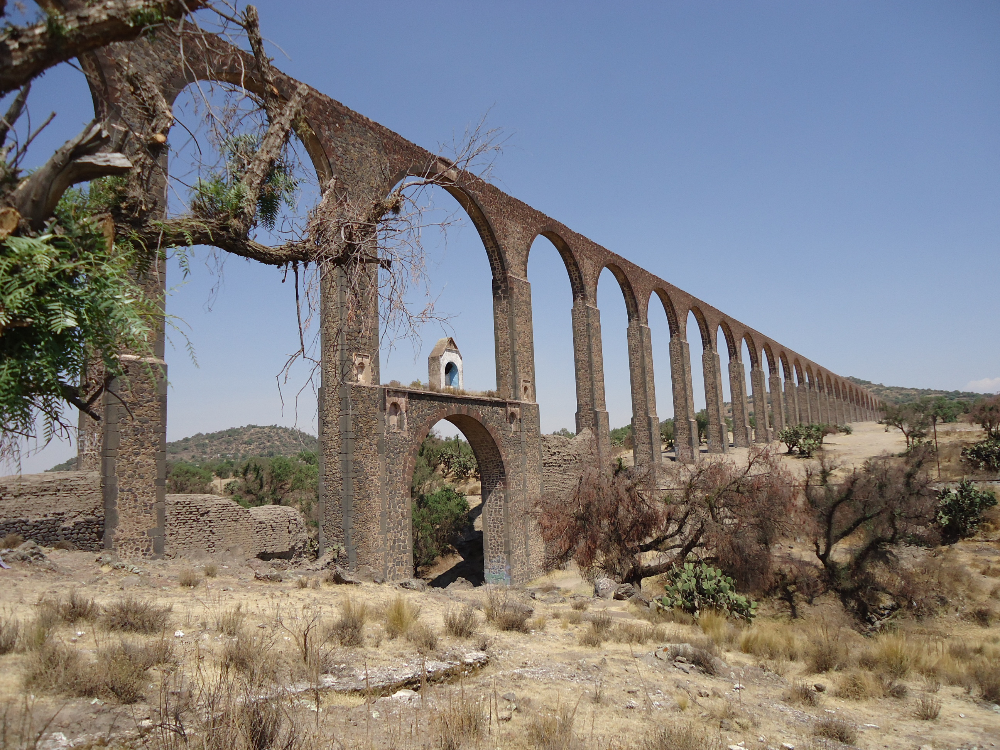

# Paper for Riverine Workshop, Dumbarton Oaks, 2024-03-25 - 2024-03-29

## Amphibious Lives in an Early-Colonial Mexican Riverine: Responses to Aquatic Abundance during the 16th-c Pluvial, San Juan Teotihuacan, Mexico

[Online version of this draft paper](https://brad-skopyk.github.io/sjt.html)

Brad Skopyk  
Assoc. Professor  
Department of History  
Binghamton University  
[bskopyk@binghamton.edu](mailto:bskopyk@binghamton.edu)  

## Abstract

Using the Códice de San Juan Teotihuacan (ca. 1557), an early-colonial indigenous painted manuscript, this paper examines the contentions between indigenous and Spanish riverine cultures in the community of Teotihuacan, near Mexico City during a millennial-scale pluvial from roughly between 1545 and 1630. The manuscript depicts the indigenous Teotihuacanos’s two-year campaign to construct a Franciscan church and monastery complex at the heart of the town's marshes and springs and its violent suppression by Augustinian monks and viceregal authorities. Known as atepocates (tadpoles) because of their amphibious lifeways and aqueous geography, the Teotihuacanos approached the pluvial adroitly, using hydrological excess as a tool to assert control over community resources and to oppose the competing interests of neighboring indigenous towns and of imperial actors. They also sided with the Franciscans, possibly because of the order’s commitment to hydraulic engineering and, especially, because of a monumental Franciscan aqueduct being built in Otumba, a neighboring territory (1553-1570). Through litigation, theft and violence, the Teotihuacanos crafted and preserved a unique vision of the riverine that emphasized both the utilitarian and spiritual value of water. As the pluvial contributed to flooding across central Mexico, Teotihuacan relied on its knowledge, skills, and history with water, positioning itself as a reliable source of aquatic governance in the face of the tangible risks of excess water. It won multiple rounds of litigation, maintaining control over its water until the springs ran dry in the 1990s. Through a close reading of key early-colonial sources, Teotihuacan provides an opportunity to reflect upon how various cultures of the riverine persisted, interacted, and conflicted during a key hydrological and political era.

## Introduction

Thirty-six years after the Spanish conquest of the Aztec Empire, 

<figure>
    
    <figcaption>The Códice de San Juan Teotihuacan is held by the Biblioteca Nacional de Antropología e Historia and is dated to ca. 1559. <a href="images/codice-sjt-adjust.jpg">High Res Image</a></figcaption>
</figure>

<figure>
    
    <figcaption>The aquaduct was built between 1557 and 1575.</figcaption>
</figure>

### Political context

### Religious context

### Climatic Context

### The Códice de SJT
