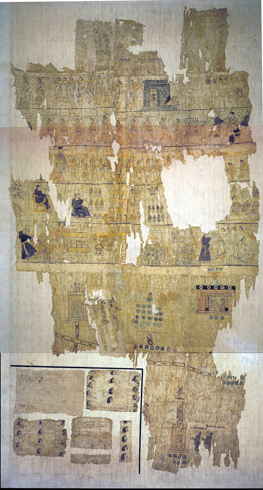

# Channelling Sacred Water in a Colonial Mexican Riverine: Native and Franciscan Waterscape Architects in the Indigenous Village of San Juan Teotihuacan, 1545 - 1580

[Download pdf version of this paper](https://brad-skopyk.github.io/sjt.pdf)

Brad Skopyk  
Assoc. Professor  
Department of History  
Binghamton University  
[bskopyk@binghamton.edu](mailto:bskopyk@binghamton.edu)  

## Abstract

Using the Códice de San Juan Teotihuacan (ca. 1557), an early-colonial indigenous painted manuscript, this paper examines the contentions between indigenous and Spanish riverine cultures in the community of Teotihuacan, near Mexico City during a millennial-scale pluvial from roughly between 1545 and 1630. The manuscript depicts the indigenous Teotihuacanos’s two-year campaign to construct a Franciscan church and monastery complex at the heart of the town's marshes and springs and its violent suppression by Augustinian monks and viceregal authorities. Known as atepocates (tadpoles) because of their amphibious lifeways and aqueous geography, the Teotihuacanos approached the pluvial adroitly, using hydrological excess as a tool to assert control over community resources and to oppose the competing interests of neighboring indigenous towns and of imperial actors. They also sided with the Franciscans, possibly because of the order’s commitment to hydraulic engineering and, especially, because of a monumental Franciscan aqueduct being built in Otumba, a neighboring territory (1553-1570). Through litigation, theft and violence, the Teotihuacanos crafted and preserved a unique vision of the riverine that emphasized both the utilitarian and spiritual value of water. As the pluvial contributed to flooding across central Mexico, Teotihuacan relied on its knowledge, skills, and history with water, positioning itself as a reliable source of aquatic governance in the face of the tangible risks of excess water. It won multiple rounds of litigation, maintaining control over its water until the springs ran dry in the 1990s. Through a close reading of key early-colonial sources, Teotihuacan provides an opportunity to reflect upon how various cultures of the riverine persisted, interacted, and conflicted during a key hydrological and political era.

## Introduction

The *Códice de San Juan Teotihuacan* (ca. 1559) is an early-colonial indigenous painted manuscript that depicts a wide variety of violent encounters between friars of the Augustinian mendicant order and the local indigenous people of the village of San Juan Teotihuacan, located about fifty kilometers northeast of Mexico City. In one image, a friar kicks a traditionally-clothed native laying on the ground; in another, a provincial magistrate wields a club, held high over the body of a native man on his knees. There are images of natives carrying beams and timbers, and others representing enumerated bundles and baskets of food, i.e. payments of tribute.

tells the history of the construction of a church, monastery and associated hydrological infrastructure in the native village of San Juan Teotihuacan, located about fifty kilometers northeast of Mexico City. Although the codex is deteriorated and incomplete, it clearly recounts how, in 1557, friars of the Augustinian mendicant order had declared the village to be under their exclusive domain (i.e. their *doctrina*), a declaration that despite the clear local native preference for Franciscan tutelage. The codex depicts a wide variety of hardships that were suffered by the Teotihuacanos during the initial planning and early construction phases of the project, such as tribute payments, labor services, imprisonment, and physical assaults by Augustinian friars and regional magistrates. Local resistance continued for nearly two years, culminating in the near total abandonment of the town for ten months in 1558 and 1559 in order to deprive the unwanted Augustinians of sustenance and service. The success of the strategy is illustrated by triumphant images of two separate jailbreaks of native elite, visits to the Viceroy in Mexico City, and another to one of the highest judges in all of New Spain, and ultimately birth and marriage ceremonies at the new church site.

The few extant interpretations of this uprising have left us with an almost entirely political and economic interpretation of events, focusing upon the corporal hardships of church construction, especially when led by Augustinian friars. This paper, however, takes a hydrological perspective, or more properly a riverine perspective, which integrates this event into a wider history of deliberate attempts by both local indigenous peoples and representatives of the church to channel water (both literally and metaphorically) through the visible and invisible, material and immaterial, living and nonliving, and profane and sacred. For both natives and friars, the riverine was a critical geography to (re)build an aqueous landscape that could mimic and model a divine oasis while also furnishing economic benefits from the effective management of soil and water.

Political and economic interpretations cannot adequately explain either the cause of the revolt or the sustained determination of the local population. So what *was* the plan in 1557? Why risk death, local insolvency, and failure when the monetary and human costs of construction would be very similar under either Augustinian or Franciscan leadership? I contend that the willingness to set upon this plan makes sense only through the lens of the colonial hydroscope where the many benefits of investing in the riverine can be brought into focus. Both Teotihuacanos and Franciscans knew well the power of water within both the sacred and profane and actively sought to manipulate the riverine for their benefit. Given the importance of water to the Teotihuacano self-image and identity--and also to the Franciscan ideal of the sacred and their hydraulic engineering projects which sought to capture both water and souls--the merging of these two riverine cultures should not surprise.

This is my first foray into these murky waters, using as beacons the historiographies of pre- and early-colonial indigenous religion, Christian architecture, and colonial water engineering, but also taking advantage of the rich water history of Teotihuacan, when dams, canals, watermills, reservoirs, aqueducts, and other technologies were enthusiastically pursued immediately after the native-Franciscan alliance of 1559.

San Juan Teotihuacan is an indigenous Nahuatl-speaking population that is now a municipal head-town and, in the sixteenth century, a lower level administrative unit called (in Spanish) a 'pueblo' (i.e. people) or (in Nahuatl) an 'altepetl'. The pueblo had dependencies which were called sujetos in Spanish and 'capolli' or 'tlaxilacalli' in Nahuatl.

In 1563, the indigenous Nahuatl-speaking population of the village of San Juan Teotihuacan initiated a process of sacred water landscape conversion, essentially rebuilding their precolumbian waterscape to fit the new Spanish imperial order.

Much of their *physical/material* sacred sphere had been suppressed by the Spanish. Much, but not all.

Mundane civic pictographic manuscripts, like the Codex Xolotl that we viewed on Tuesday morning, which was likely produced by relatives of the Teotihuacan family, often remained or were reproduced in a mixed-media, mixed-language style that better suited colonial officials. By contrast, texts with religious themes were extracted and burned.

Throughout central Mexico, where Teotihuacan is located, sacred architecture was deliberately pulled apart, stone by stone.

The extracted stones were then reused to build religious and administrative buildings. In other cases, religious architecture was built over, on top of, like the church and monastery of Cholula.

In Teotihuacan, however, the great pyramids of the sun and moon, along with the hundreds of structures (and murals) along the two-mile-long avenue of the dead, were untouched. This incredible archaeological site that rose to prominence in the first six to seven centuries of the common era, was located just 1.5 kms from the town's administrative buildings.

In fact, large stone statues that evoked cosmological forces (called *teotl*) still stood at the top of these pyramids as late as 1580. Because they were too heavy to carry away, resident Franciscan friars ordered that they be thrown down the steps of the pyramid. One can only , an event, with such wonderful cosmological symbolism, that was undoubtedly made into a powerful ceremony by the natives. Teotihuacan is generally 

The 

Not everything had been (just forty-four years prior), a replacement (in some respects)  which had been largely lost or driven   spiritual the monastery and church buildings, along with the  and, importantly, the atrium, open chapel, complex waterworks  of

,  is located about fifty kilometers northwest of Mexico City. It was also built in at the southern edge of a large, shallow wetland, marked by hundreds of natural springs.

The indigenous peoples of Central Mexico

Thirty-six years after the Spanish conquest of the Aztec empire, the Nahuatl-speaking villagers of San Juan Teotihuacan initiated a violent uprising

<figure>
    
    <figcaption>The Códice de San Juan Teotihuacan is held by the Biblioteca Nacional de Antropología e Historia and is dated to ca. 1559. <a href="assets/images/codice-sjt-adjust.jpg">High Res Image</a></figcaption>
</figure>

<figure>
    
    <figcaption>The aqueduct was built between 1557 and 1575.</figcaption>
</figure>

### Political context

### Religious context

### Climatic Context

<iframe src="test.html" style="height:600px;width:100%;" title="Aggregate events with timeslider"></iframe>

### The Códice de SJT

### Sources

Johnson, Benjamin D. Pueblos within Pueblos Tlaxilacalli Communities in Acolhuacan, Mexico, ca. 1272-1692. Boulder: University Press of Colorado, 2017.

Johnson, Benjamin Daniel. “Remaking the Hinterland: Commoners, Colonialism, and Social Order in Post-Conquest Texcoco and Teotihuacán, Mexico.” History. Dissertation, University of Chicago, 2011.
